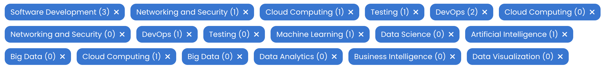
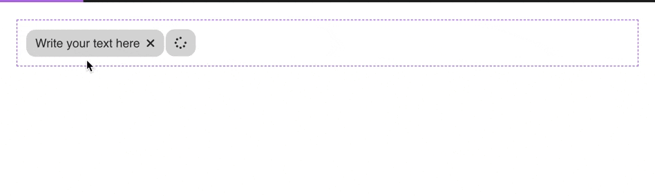

# Overview

The Tags component for Qodly Studio is an iterative component designed to dynamically display chips using the Text Component as its foundation.

## Tags Component

Classified under iterative components, the Tags component is specialized for rendering dynamic chips. It leverages the Text Component to display content.

## Properties

| **Property Name**       | **Type**         | **Description**                                                                                                                              |
| ----------------------- | ---------------- | -------------------------------------------------------------------------------------------------------------------------------------------- |
| **Qodly Source**        | Entity Selection | Specifies the entity selection used as the data source for the Tags component.                                                               |
| **Selected Element**    | Entity Selection | Defines the entity that serves as the selected element or entity.                                                                            |
| **Iterate with**        | Entity Selection | Determines the entity used for iteration within the tag component. The default is `$this`, allowing dynamic data display.                    |
| **Load More Component** | Entity Selection | Indicates the component used to load additional data based on the Page Size. A "Load More" button may be necessary for displaying more tags. |
| **Enable Action**       | Boolean          | Activates actions within the Tags component, such as deleting tags.                                                                          |
| **Action Icon**         | Icon             | Sets the icon linked to the action, with the default being a cross icon for deletion.                                                        |
